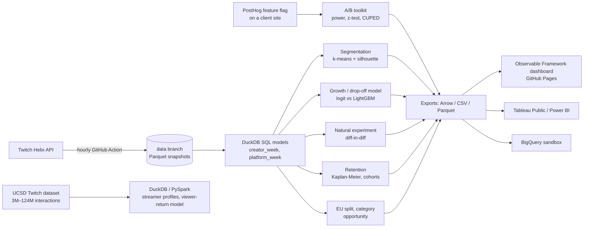

# LiveScope

**Which live-streaming creators are growing, which are at risk of dropping off, and what helps them grow?**

LiveScope collects its own dataset of Twitch live streams every hour, models it in SQL, segments creators, predicts next-week growth, analyses a natural experiment, and publishes the results as a dashboard that rebuilds itself.

- **Dashboard:** [akshajan-r.github.io/LiveScope](https://akshajan-r.github.io/LiveScope/), rebuilt daily from the latest data
- **Tableau Public workbook:** _link once published_ ([docs/tableau.md](docs/tableau.md))

## Findings: recommendations for a creator-success team

> **Status: collecting data (started 2 October 2026).** This page is written once the evidence exists: retention needs about 4 complete weeks of follow-up, and the growth model and the peak-hours experiment need 6 or more. Until then each section says what it will answer and where the evidence comes from. The dashboard's [Findings page](https://akshajan-r.github.io/LiveScope/findings) shows the measured numbers as they accumulate; every number below will be copied from it, with its confidence interval and sample size.

**Who this is for:** a team whose job is to get more creators streaming LIVE, keep them streaming, and help them grow, with a focus on the EU.

**Scope of the evidence:** Twitch creators who reached the top 2,000 live streams, followed hourly from then on. Language stands in for market. Findings describe established and breakthrough creators, not first-time streamers.

### 1. Keeping new creators live

- **Question:** once a creator breaks through, how many are still streaming after 1, 2, 4 and 8 weeks, and when is drop-off steepest?
- **Evidence:** Kaplan–Meier survival and cohort retention ([Retention](https://akshajan-r.github.io/LiveScope/retention)).
- **Finding:** _pending_
- **Recommendation:** _pending_ (for example, the week where survival falls fastest is where an onboarding check-in would go)

### 2. The EU opportunity

- **Question:** do creators streaming in EU/EEA languages get more or less audience per live hour than English-language creators, and do they keep streaming as long?
- **Evidence:** viewers per live hour and drop-off by language; newcomer survival EU vs English with a log-rank test ([Europe](https://akshajan-r.github.io/LiveScope/europe)).
- **Finding:** _pending_
- **Recommendation:** _pending_

### 3. Where to point new creators

- **Question:** which categories have strong audience per creator but few creators serving them, overall and within EU languages?
- **Evidence:** category opportunity index, using medians and excluding single-star categories ([Categories](https://akshajan-r.github.io/LiveScope/categories)).
- **Finding:** _pending_
- **Recommendation:** _pending_, phrased as a test to run (invite creators into a category and compare them with a matched group that was not invited)

### 4. Spotting growth and risk early

- **Question:** can next week's growth or drop-off be predicted better than "last week's trend continues", and which signals matter?
- **Evidence:** held-out ROC AUC against a momentum baseline, feature importance, segments ([Growth model](https://akshajan-r.github.io/LiveScope/models), [Creators](https://akshajan-r.github.io/LiveScope/creators)).
- **Finding:** _pending_
- **Recommendation:** _pending_

### 5. Does streaming at peak hours help?

- **Question:** when creators move into peak hours, does their audience change?
- **Evidence:** difference-in-differences with an event-study pre-trend check ([Experiments](https://akshajan-r.github.io/LiveScope/experiments)). Observational, so it suggests rather than proves.
- **Finding:** _pending_
- **Recommendation:** _pending_

### Limits

Top-list creators only; language is not country; hourly sampling; one natural experiment, not a randomised test. The A/B toolkit is validated on simulations. A real experiment run with it is documented in [docs/experiments.md](docs/experiments.md) once complete.

## How it works



| Step | What | Code |
|---|---|---|
| Ingestion | Hourly snapshot of the top 2,000 live streams plus a tracking panel of up to 30,000 creators, with data-quality checks; appended to the `data` branch | [`livescope/ingest`](livescope/ingest), [`collect.yml`](.github/workflows/collect.yml) |
| SQL models | Staging, creator-hour, creator-week (growth, streaks via gaps-and-islands), platform KPIs, peak hours | [`livescope/sql`](livescope/sql) |
| Metric design | North-star metric, OKR tree, metric definitions | [`docs/metrics.md`](docs/metrics.md) |
| Segmentation | k-means on creator features, k by silhouette, GMM/BIC check, rule-based segment names | [`segmentation.py`](livescope/segmentation.py) |
| Retention | Cohort retention and Kaplan–Meier survival with Greenwood CIs and log-rank tests, for creators tracked after breaking into the top list | [`sql/10_retention.sql`](livescope/sql/10_retention.sql), [`survival.py`](livescope/survival.py) |
| EU focus | Language groups (EU/EEA vs English vs Spanish & Portuguese); audience, growth, drop-off, survival and segment mix by group | [`sql/09_language.sql`](livescope/sql/09_language.sql) |
| Category opportunity | Median audience per creator vs number of creators per category, overall and per language group, with single-star and trend flags | [`sql/11_category_opportunity.sql`](livescope/sql/11_category_opportunity.sql) |
| Prediction | Next-week growth and drop-off; time-based split; base rate vs momentum rule vs logistic regression vs LightGBM; ROC/PR AUC, permutation importance | [`predict.py`](livescope/predict.py) |
| A/B testing | Sample size, power, MDE, two-proportion z-test, Welch's t-test, CUPED, SRM, non-inferiority guardrails; validated on simulated experiments; PostHog feature-flag pull and readout for a real test | [`livescope/experiments`](livescope/experiments), [`docs/experiments.md`](docs/experiments.md) |
| Natural experiment | Peak-hours difference-in-differences with an event study | [`causal/did.py`](livescope/causal/did.py) |
| Large dataset | UCSD Twitch interactions processed with DuckDB, or PySpark for the full 124M rows; viewer-return model | [`ucsd.py`](livescope/ucsd.py), [`spark/`](spark), [`ucsd.yml`](.github/workflows/ucsd.yml) |
| Dashboard | SQL-driven static site (DuckDB-wasm in the browser), rebuilt daily | [`dashboard/`](dashboard) |
| Cloud | Optional load of every table into BigQuery | [`bigquery.py`](livescope/bigquery.py) |

Data sources, sampling and their biases are documented in [docs/data.md](docs/data.md). The main one: creators enter the data by ranking in the top 2,000, so results describe the most-watched part of Twitch, not the long tail.

## Run it

```bash
pip install -e ".[dev]"
python -m pytest                      # 50+ tests: SQL models, ingestion, models, stats, survival, DiD, PostHog, Spark parity

# Synthetic data for development (labelled as synthetic on every dashboard page)
LIVESCOPE_DATASTORE=demo-store python -m livescope demo
LIVESCOPE_DATASTORE=demo-store python -m livescope build
cp exports/dashboard/* dashboard/src/data/ && cd dashboard && npm install && npm run dev
```

Collecting real data needs a free Twitch developer app and two repository secrets; see [docs/setup.md](docs/setup.md).

## Repository layout

```
livescope/            Python package (python -m livescope <command>)
  ingest/             Helix client, snapshot writer, data-quality checks
  sql/                DuckDB models, run in file order
  experiments/        A/B testing toolkit
  causal/             difference-in-differences
dashboard/            Observable Framework site
spark/                PySpark job for the full UCSD dataset
scripts/              data-branch helpers used by the workflows
docs/                 metrics, data, setup, experiments, Tableau
tests/
```
