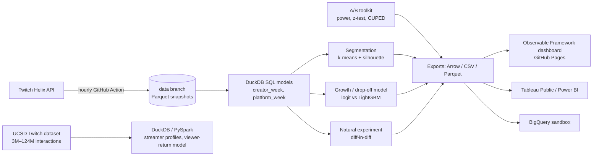

# LiveScope

**Which live-streaming creators are growing, which are at risk of dropping off, and what helps them grow?**

LiveScope collects its own dataset of Twitch live streams every hour, models it in SQL, segments creators, predicts next-week growth, analyses a natural experiment, and publishes the results as a dashboard that rebuilds itself.

- **Dashboard:** `https://akshajan-r.github.io/LiveScope/` (live once GitHub Pages is enabled, see [docs/setup.md](docs/setup.md))
- **Tableau Public workbook:** _link once published_ ([docs/tableau.md](docs/tableau.md))

## Findings

> **Status: collecting data.** The pipeline, models and dashboard are built and tested, but no findings are reported until enough real data exists: segmentation needs four complete weeks, and the growth model and the natural experiment need six or more. Every number below will come from the published dashboard; none are estimated.

| # | Question | Where the answer will come from |
|---|---|---|
| 1 | What separates creators who grow from those who stall? | Segment profiles + growth-model feature importance |
| 2 | Can next-week growth or drop-off be predicted better than "last week's trend continues"? | Model comparison on held-out weeks (ROC AUC vs the momentum baseline) |
| 3 | Does moving into peak hours change a creator's audience? | Difference-in-differences with an event-study pre-trend check |

Each finding will get one chart and a recommendation for a creator-success team.

## How it works



| Step | What | Code |
|---|---|---|
| Ingestion | Hourly snapshot of the top 2,000 live streams plus a 5,000-creator tracking panel, with data-quality checks; appended to the `data` branch | [`livescope/ingest`](livescope/ingest), [`collect.yml`](.github/workflows/collect.yml) |
| SQL models | Staging, creator-hour, creator-week (growth, streaks via gaps-and-islands), platform KPIs, peak hours | [`livescope/sql`](livescope/sql) |
| Metric design | North-star metric, OKR tree, metric definitions | [`docs/metrics.md`](docs/metrics.md) |
| Segmentation | k-means on creator features, k by silhouette, GMM/BIC check, rule-based segment names | [`segmentation.py`](livescope/segmentation.py) |
| Prediction | Next-week growth and drop-off; time-based split; base rate vs momentum rule vs logistic regression vs LightGBM; ROC/PR AUC, permutation importance | [`predict.py`](livescope/predict.py) |
| A/B testing | Sample size, power, MDE, two-proportion z-test, Welch's t-test, CUPED, SRM, non-inferiority guardrails; validated on simulated experiments | [`livescope/experiments`](livescope/experiments), [`docs/experiments.md`](docs/experiments.md) |
| Natural experiment | Peak-hours difference-in-differences with an event study | [`causal/did.py`](livescope/causal/did.py) |
| Large dataset | UCSD Twitch interactions processed with DuckDB, or PySpark for the full 124M rows; viewer-return model | [`ucsd.py`](livescope/ucsd.py), [`spark/`](spark), [`ucsd.yml`](.github/workflows/ucsd.yml) |
| Dashboard | SQL-driven static site (DuckDB-wasm in the browser), rebuilt daily | [`dashboard/`](dashboard) |
| Cloud | Optional load of every table into BigQuery | [`bigquery.py`](livescope/bigquery.py) |

Data sources, sampling and their biases are documented in [docs/data.md](docs/data.md). The main one: creators enter the data by ranking in the top 2,000, so results describe the most-watched part of Twitch, not the long tail.

## Run it

```bash
pip install -e ".[dev]"
python -m pytest                      # 40+ tests: SQL models, ingestion, models, stats, DiD, Spark parity

# Synthetic data for development (labelled as synthetic on every dashboard page)
LIVESCOPE_DATASTORE=demo-store python -m livescope demo
LIVESCOPE_DATASTORE=demo-store python -m livescope build
cp exports/dashboard/* dashboard/src/data/ && cd dashboard && npm install && npm run dev
```

Collecting real data needs a free Twitch developer app and two repository secrets; see [docs/setup.md](docs/setup.md).

## Repository layout

```
livescope/            Python package (python -m livescope <command>)
  ingest/             Helix client, snapshot writer, data-quality checks
  sql/                DuckDB models, run in file order
  experiments/        A/B testing toolkit
  causal/             difference-in-differences
dashboard/            Observable Framework site
spark/                PySpark job for the full UCSD dataset
scripts/              data-branch helpers used by the workflows
docs/                 metrics, data, setup, experiments, Tableau
tests/
```
